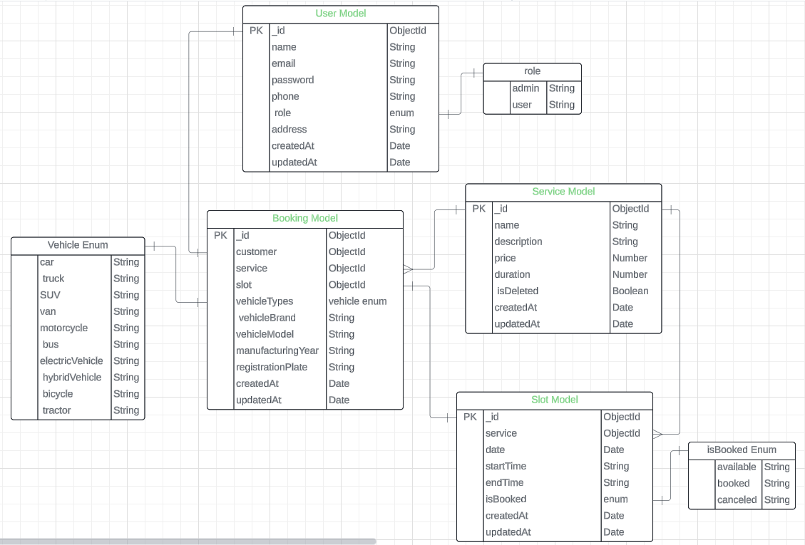

# Car Wash Management System

[Live URL](https://car-washing-backend.vercel.app/)

## Table of Contents

- [Introduction](#introduction)
- [Features](#features)
- [Technologies Used](#technologies-used)
- [Setup and Installation](#setup-and-installation)
- [postman collection](#postman-Collection)
- [Usage](#usage)

## Introduction

**Car Wash Management System** is a comprehensive solution for managing car wash services. This application allows customers to book car wash services online, and administrators to manage bookings, services, and availability efficiently. The system is built using Node.js and TypeScript, providing a scalable and maintainable codebase with essential tools and configurations.

## Features

- **User Authentication**: Secure authentication using JWT and bcrypt.
- **Environment Configuration**: Manage environment variables with dotenv.
- **Input Validation**: Robust input validation with Zod.
- **Database Integration**: Seamless integration with MongoDB using Mongoose.
- **Code Quality**: Enforced coding standards with ESLint and Prettier.

## Technologies Used

- **Backend**:

  - Node.js
  - Express.js
  - TypeScript

- **Database**:

  - MongoDB
  - Mongoose

- **Other Tools**:
  - Vercel (for hosting)
  - Git

## ER Diagram

Below is the Entity-Relationship (ER) diagram for the project:



## Setup and Installation

Follow these steps to set up the project locally:

1. **Clone the repository:**
   ```sh
   git clone https://github.com/ahmedhimel21/car_washing_service_backend
   ```
2. **Navigate to the project directory:**
   ```sh
   cd your-repo-name
   ```
3. **Install dependencies:**
   ```sh
   npm install
   ```
4. **Set up environment variables:**
   ```
   Create a .env file in the root directory and add the necessary environment variables as shown in .env.example.
   ```
5. **Build the project:**
   ```sh
   npm run build
   ```
6. **Start the application in development mode:**
   ```sh
   npm run start:dev
   ```
7. **Open the application in your browser:**
   ```
   Go to http://localhost:5000
   ```

### Postman Collection

To facilitate testing and development, we provide a Postman collection that includes predefined requests. You Download this , and import it in your postman if you needed.:

- [Download Postman Collection](./car%20washing%20service.postman_collection.json)

## Usage

To use the application, follow these steps:

1. **Sign Up/Login**: Access the authentication endpoints to create an account or log in.
2. **Protected Routes**: Use JWT to access protected routes after authentication.
3. **Database Operations**: Perform CRUD operations using the provided API endpoints.
